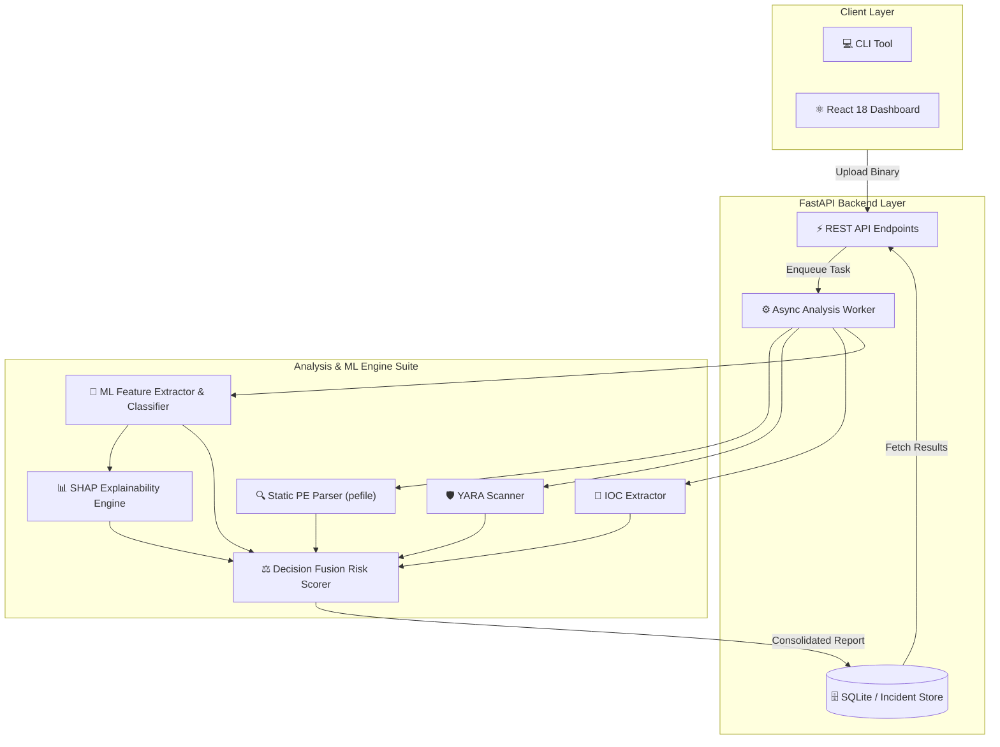

<div align="center">

# 🛡️ Zeravynex

### **Secure Explainable AI Static Malware Analysis Platform**

*Deep Structural Inspection • Machine Learning Triage • SHAP Explainability • Threat Intelligence*

[](https://github.com/intrance7/Zeravynex/actions/workflows/ci.yml)
[](https://github.com/intrance7/Zeravynex/actions/workflows/codeql.yml)
[](https://python.org)
[](https://fastapi.tiangolo.com)
[](https://reactjs.org)
[](https://www.typescriptlang.org)
[](LICENSE)
[](CONTRIBUTING.md)

<br/>

[Key Features](#-key-features) • [System Architecture](#-system-architecture) • [Quickstart](#-quickstart) • [API Reference](#-api-reference) • [Roadmap](#-project-roadmap) • [Contributing](#-contributing)

</div>

---

## 🌟 Overview
**Zeravynex** is a production-grade static malware analysis and threat triage platform for Windows Portable Executable (`.exe`, `.dll`) files. 

Unlike traditional black-box detection tools, Zeravynex provides **transparent, explainable security decisions** by fusing deterministic heuristics, YARA signatures, machine learning models, and **SHAP (SHapley Additive exPlanations)** to explain *why* a binary was classified as malicious.


> ⚠️ **Safety Notice**: Zeravynex performs **Static Analysis ONLY**. Uploaded binaries are never dynamically executed on the host.

---

## ✨ Key Features

| Capability | Description |
|---|---|
| 🔍 **Deep PE Parsing** | Analyzes DOS/NT/Optional headers, section permissions (`RWX`), entry-point anomalies, entropy distribution, and compile timestamps. |
| 🛡️ **YARA Rule Engine** | Integrated pattern matching for known malware families, UPX/packers, process injection primitives, and ransomware artifacts. |
| 🎯 **IOC Extraction** | Automatic regex extraction of IPv4 addresses, domains, URLs, registry persistence keys, file system paths, and mutexes. |
| 🤖 **Explainable Machine Learning** | 25-dimensional feature extractor with a calibrated Classifier + **SHAP waterfall attributions** showing exact push factors. |
| ⚖️ **Decision Fusion Engine** | Multi-signal risk aggregator scoring threats from 0 to 100 (`CLEAN`, `SUSPICIOUS`, `HIGH RISK`, `CRITICAL MALWARE`). |
| ⚡ **Modern Web Dashboard** | Sleek React 18 + TypeScript interface with section entropy graphs, live risk gauges, and IOC exploration. |
| 💻 **CLI & API First** | Inspect binaries via a command-line interface or consume via comprehensive FastAPI REST endpoints. |

---

## 🏗️ System Architecture



---

## 🚀 Quickstart

### Prerequisites
- **Python 3.11+**
- **Node.js 18+** & `npm`
- **Git**

### 1. Clone the Repository
```bash
git clone https://github.com/intrance7/Zeravynex.git
cd Zeravynex
```

### 2. Backend Setup
```bash
# Set up Python virtual environment
python -m venv venv

# Activate virtual environment
# Windows:
.\venv\Scripts\Activate.ps1
# Linux/macOS:
source venv/bin/activate

# Install dependencies
pip install -r backend/requirements.txt

# Start the FastAPI server
cd backend
uvicorn app.main:app --reload --host 0.0.0.0 --port 8000
```
API Documentation will be available at: **`http://localhost:8000/docs`**

### 3. Frontend Setup
```bash
# In a new terminal window
cd frontend

# Install dependencies
npm install

# Start Vite development server
npm run dev
```
Web Dashboard will be available at: **`http://localhost:5173`**

### 4. CLI Usage
You can also run static analysis directly from the terminal without starting the web UI:
```bash
python -m app.engines.static_analysis.cli path/to/sample.exe
```

---

## 📡 API Reference

| Method | Endpoint | Description |
|---|---|---|
| `GET` | `/api/v1/health` | Healthcheck and service readiness status |
| `POST` | `/api/v1/analyze` | Submit PE binary for static malware analysis |
| `GET` | `/api/v1/history` | Retrieve recent sample analysis history |
| `GET` | `/api/v1/report/search` | Search past analyses by filename or hash |
| `GET` | `/api/v1/report/{sha256}` | Retrieve comprehensive report by sample SHA256 hash |
| `GET` | `/api/v1/report/id/{analysis_id}` | Retrieve analysis report by record ID |

---

## 🗺️ Project Roadmap

- [x] **Phase 0: Architecture Specification** — System design & risk model specification
- [x] **Phase 1: Malware Analysis Engine** — PE header parsing, section entropy, IOC extraction & CLI
- [x] **Phase 2: Heuristics & YARA Engine** — Signature scanner and evidence-weighted risk scoring
- [x] **Phase 3: Machine Learning & Explainability** — 25D PE feature extractor, classifier, and SHAP explanations
- [x] **Phase 4: Decision Fusion Engine** — Multi-signal scoring engine
- [x] **Phase 5: Backend API & Persistence** — FastAPI endpoints & SQLite database
- [x] **Phase 6: React Dashboard** — Threat overview, entropy charts, SHAP visualizer, and history
- [ ] **Phase 7: AI Analyst Engine** — LLM narrative threat summaries & MITRE ATT&CK auto-mapping
- [ ] **Phase 8: Desktop Packaging** — Tauri cross-platform desktop shell

---

## 🧪 Testing

Run backend unit and integration tests:
```bash
cd backend
pytest tests/ -v
```

Typecheck and build the frontend:
```bash
cd frontend
npm run build
```

---

## 🤝 Contributing

Contributions are welcome! Please check out [CONTRIBUTING.md](CONTRIBUTING.md) for contribution guidelines, coding standards, and branch conventions.

---

## 🔒 Security

For vulnerability disclosures and reporting procedures, please refer to [SECURITY.md](SECURITY.md).


---

## 📄 License
This project is licensed under the terms of the [MIT License](LICENSE).
